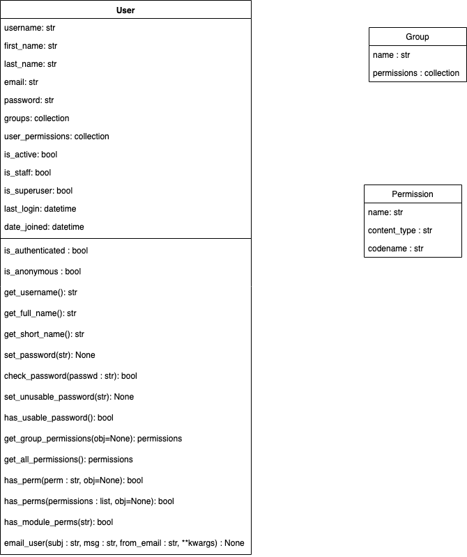

# Django Class Notes
Authentications

### Nice to have VSCode Extentions:
- Djaneiro - Django Snippets  (Be carefull about other conflicting extentions!)

### Needs
- Python, add the path environment variable
- pip
- virtualenv

### Summary
- Create project
- Secure your project
  - .gitignore
  - django-decouple
- Create app
- Login Admin Site
  - Migrate
  - Create superuser
- Add users programmatically
- Adding users with auth
  - Modify project url pattern
  - Create url on app
  - Create View
  - Create Login template
  - Modify view to add new users
- Password Change


### Core

There is Django’s authentication system in its default configuration. 

This configuration has evolved to serve the most common project needs, handling a reasonably wide range of tasks, and has a careful implementation of passwords and permissions. 

For projects where authentication needs differ from the default, Django supports extensive extension and customization of authentication.

User objects are the core of the authentication system. They typically represent the people interacting with your site and are used to enable things like restricting access, registering user profiles, associating content with creators etc.

The primary attributes of the default user are:

- username
- password
- email
- first_name
- last_name

The authentication that comes with Django is good enough for most common cases, but you may have needs not met by the out-of-the-box defaults.


### Django Authentication System

According to Django the authentication system aims to be very generic, and so does not provide some features provided in other web authentication systems. Solutions for some common problems are available as third-party packages. For example, throttling of login attempts and authentication against third parties (e.g. OAuth).

The necessary configuration was all done for us when we created the app using the django-admin startproject command. The database tables for users and model permissions were created when we first called python manage.py migrate.

```py
INSTALLED_APPS = [
    ...
    'django.contrib.auth',  # Core authentication framework and its default models.
    'django.contrib.contenttypes',  # Django content type system (allows permissions to be associated with models).
    ....

MIDDLEWARE = [
    ...
    'django.contrib.sessions.middleware.SessionMiddleware',  # Manages sessions across requests
    ...
    'django.contrib.auth.middleware.AuthenticationMiddleware',  #  Associates users with requests using sessions.
    ....
```

# Create project

- Create a working directory, name it as you wish, cd to new directory
- Create virtual environment as a best practice:
```py
python3 -m venv env # for Windows or
python -m venv env # for Windows
virtualenv env # for Mac/Linux or;
virtualenv yourenv -p python3 # for Mac/Linux
```
- Activate scripts:
```bash
.\env\Scripts\activate  # for Windows
source env/bin/activate  # for MAC/Linux
```
- See the (env) sign before your command prompt.
- Install django:
```bash
pip install django
```
- See installed packages:
```sh
pip freeze

# you will see:
asgiref==3.3.4
Django==3.2.4
pytz==2021.1
sqlparse==0.4.1

# If you see lots of things here, that means there is a problem with your virtual env activation. 
# Activate scripts again
```
- Create requirements.txt same level with working directory, send your installed packages to this file, requirements file must be up to date:
```py
pip freeze > requirements.txt
```

- Create project:
```py
django-admin startproject authenticate
django-admin startproject authenticate . 
# With . it creates a single project folder.
# Avoiding nested folders
# Alternative naming:
django-admin startproject main . 
```
- Various files has been created!
- Check your project if it's installed correctly:
```py
python manage.py runserver
py -m manage.py runserver
```
- (Optional) Change the name of the project main directory as src to distinguish from subfolder with the same name!
```bash
# optional
mv .\clarusway\ src
```
- Lets create first application:
- Go to the same level with manage.py file:
```bash
cd .\src\
```

# Secure your project

### .gitignore

Add standard .gitignore file to the project root directory. 

Do that before adding your files to staging area, else you will need extra work to unstage files to be able to ignore them.

### python-decouple

- To use python decouple in this project, first install it:
```py
pip install python-decouple
```
- For more information: https://pypi.org/project/python-decouple/
- Import the config object on settings.py file:
```py
from decouple import config
```
- Create .env file on root directory. We will collect our variables in this file.
```py
SECRET_KEY = o5o9...
```
- Retrieve the configuration parameters in settings.py:
```py
SECRET_KEY = config('SECRET_KEY')
```
- Now you can send you project to the github, but be sure you added a .gitignore file which has .env on it.

# Create app

- Start app
```py
python manage.py startapp user_example

# Alternative naming:
python manage.py startapp home
```

- Go to settings.py and add the app to the INSTALLED_APPS:
```py
'user_example'
'user_example.apps.UserExampleConfig'
```

# Login Admin Site

Authentication support is bundled as a Django contrib module in django.contrib.auth. 

By default, the required configuration is already included in the settings.py generated by django-admin startproject, these consist of two items listed in your INSTALLED_APPS setting:

- 'django.contrib.auth' contains the core of the authentication framework, and its default models.
- 'django.contrib.contenttypes' is the Django content type system, which allows permissions to be associated with models you create.

and these items in your MIDDLEWARE setting:

- SessionMiddleware manages sessions across requests.
- AuthenticationMiddleware associates users with requests using sessions.

With these settings in place, running the command manage.py migrate creates the necessary database tables for auth related models and permissions for any models defined in your installed apps.

- We need to create users. Go to manage.py level directory:
```py
python manage.py migrate
```
- In order to login, we need to create a user who can login to the admin site. Run the following command:
```py
python manage.py createsuperuser  # or with the parameters
python manage.py createsuperuser --username admin --email admin@mail.com
```
- Enter your desired username, email adress, and password twice.
- Run server.
- Go to http://127.0.0.1:8000/admin/ You should see the admin's login screen.
- After you login, you should see a few types of editable content: groups and users. They are provided by django.contrib.auth, the authentication framework shipped by Django.

You already created your first user as a superuser. 

Our superuser is already authenticated and has all permissions, so we'll need to create a test user to represent a normal site user. 

We can use the admin site to create groups and users, as it is one of the quickest ways to do so.

First lets create a new group for our website members. We don't need any permissions for the group, so just press SAVE.

Create a regular user.

### The Django Authentication Models

Django.contrib.auth.models has 
- User, 
- Permission,
- Group Models,
which serves to associate a user with some persisted data about that user along with any groups and permissions they have.

Below you can see the class diagrams for User as well as Permission and Group.




# Add users programmatically

https://docs.djangoproject.com/en/3.2/topics/auth/default/

The most direct way to create users is to use the included create_user() helper function:
```py
python manage.py shell

from django.contrib.auth.models import User

# Create user and save to the database
# create_user(username, email=None, password=None, **extra_fields)
# Creates, saves and returns a User.
user = User.objects.create_user('myusername', 'myemail@crazymail.com', 'mypassword')
# The username and password are set as given. 
# The domain portion of email is automatically converted to lowercase, and the returned User object will have is_active set to True.
# If no password is provided, set_unusable_password() will be called.
# The extra_fields keyword arguments are passed through to the User’s __init__ method to allow setting arbitrary fields on a custom user model.
# Extra fields:
User.objects.create_user('john', email='lennon@thebeatles.com', password='johnpassword', is_staff=True)
# Or
user.is_staff=True 
user.save()

# Update fields and then save again
user.first_name = 'John'
user.last_name = 'Citizen'
user.save()
```

Django does not store raw (clear text) passwords on the user model, but only a hash (see documentation of how passwords are managed for full details). Because of this, do not attempt to manipulate the password attribute of the user directly. This is why a helper function is used when creating a user.

```py
manage.py changepassword <username>

# You can also change a password programmatically, using set_password():
from django.contrib.auth.models import User

u = User.objects.get(username='john')
u.set_password('new password')
u.save()
```

If you have the Django admin installed, you can also change user’s passwords on the authentication system’s admin pages.

Django also provides views and forms that may be used to allow users to change their own passwords.

Changing a user’s password will log out all their sessions.


# Add users with auth

We want to allow adding regular users to our app.

- Go to authenticate/urls.py and add:
```py
from django.contrib import admin
from django.urls import path, include

urlpatterns = [
    path('admin/', admin.site.urls),
    ### And using some urls which Django give us about authentication:
    path('accounts/', include('django.contrib.auth.urls'))
]
```

If you look at django.contrib.auth.urls you can see the default views that are defined. That would be login, logout, password_change and password_reset.

- Navigate to the http://127.0.0.1:8000/accounts/ URL (note the trailing forward slash!) and Django will show an error that it could not find this URL, and listing all the URLs it tried. From this you can see the URLs that will work.

- Using the above method adds the following URLs with names in square brackets, which can be used to reverse the URL mappings. You don't have to implement anything else — the above URL mapping automatically maps the below mentioned URLs.

```
accounts/ login/ [name='login']
accounts/ logout/ [name='logout']
accounts/ password_change/ [name='password_change']
accounts/ password_change/done/ [name='password_change_done']
accounts/ password_reset/ [name='password_reset']
accounts/ password_reset/done/ [name='password_reset_done']
accounts/ reset/<uidb64>/<token>/ [name='password_reset_confirm']
accounts/ reset/done/ [name='password_reset_complete']
```

- Try to navigate to the login URL (http://127.0.0.1:8000/accounts/login/). This will fail, but with an error that tells you that we're missing the required template (registration/login.html) on the template search path.

- We will create a registration directory on the search path and then add the login.html file later.

- Add user_example to the project urls.py.
```py
path('', include("user_example.urls")),
```

- Create urls.py under user_example, and add:
```py
from django.urls import path
from .views import home_view

urlpatterns = [
    path('', home_view, name="home"),
]
```

### Create View

- Go to views.py in user_example directory
- Create home view by adding:
```py
def home_view(request):    
    return render(request, "user_example/home.html")
```

### Create an HTML template

- Create user_example/templates/user_example directory and create a home.html file under it:
```html
<h1>This is the home page!</h1>
```

- Run our project:
```py
python manage.py runserver
```
- Go to http://localhost:8000 in your browser, and you should see the text “This is the home page!”, which you defined in the home view.

- Try to go to the accounts page, which we added url path to the project.

- Try accounts/ and see the options coming from django.contrib.auth.urls

- Try accounts/login. We did not create login page yet. Lets create it.


### Login template

- Create templates/registration folder and login.html under this folder. This name is unique Django will look for this name.

```html
<h1>Hello this is login page!</h1>

{# Optional #}
{# If the user enters wrong password, an error message will be shown #}

    <p>Your username and password didn't match. Please try again.</p>


{# Optional #}

    
        <p>Your account doesn't have access to this page. To proceed,
        please login with an account that has access.</p>
    
        <p>Please login to see this page.</p>
    

    

<form action="" method="post">

    

    <p>Username: {{ form.username }}</p>
    <p>Password: {{ form.password }}</p>

    <input type="submit" value="login">
    
    <input type="hidden" value="{{ next }}" name="next">

</form>

{# Optional #}
{# Assumes you setup the password_reset view in your URLconf #}
  <p><a href="">Lost password?</a></p>
```
- This will display a form in which you can enter your username and password, and that if you enter invalid values you will be prompted to enter correct values when the page refreshes.

Navigate back to the login page (http://127.0.0.1:8000/accounts/login/) once you've saved your template

- If you log in using valid credentials, you'll be redirected to another page (by default this will be http://127.0.0.1:8000/accounts/profile/). The problem is that, by default, Django expects that upon logging in you will want to be taken to a profile page, which may or may not be the case. As you haven't defined this page yet, you'll get another error!

- Need to change login redirect url to fix this.

- Open the project settings.py and add the text below to the bottom. Now when you log in you should be redirected to the site homepage by default.
```py
# Redirect to home URL after login (Default redirects to /accounts/profile/)
LOGIN_REDIRECT_URL = "/"
```
- From now on, when someone login the page, the page will be redirected to home page.

### Enable views to add new users

- Add a new view to add registration.
- Go to views.py, create new view:

```py
# First import UserCreationForm
from django.contrib.auth.forms import UserCreationForm

def register(request):
    form = UserCreationForm()
    context = {
        'form': form
    }
    return render(request, "registration/register.html", context)
```

- Before creating register page, lets add it to the url list of our app;

```py
from django.urls import path
from .views import home_view, register

urlpatterns = [
    path('', home_view, name="home"),
    path('register', register, name='register')
]
```

- Create register.html under templates/registration folder.

```html
<h1>Registration page</h1>

<form action="" method="post">

    
    
    
        <p>There is something wrong what you entered!</p>
    

    {{ form.as_p }}
    {# as_p orders the scene #}

    <input type="submit" value="Register">

</form>
```

- Try to create new user
- It will send user info to register app, go to the admin page and check it!
- Cant see the new user, so we need to save new user to our users list using view
- If its a get request or post? For get requests, only showing the form is enough.  But for post request need to add someting.
- If post and creates a user, need to save it. Use if block:

```py
from django.shortcuts import redirect, render
from django.contrib.auth.forms import UserCreationForm

# add authenticate and login 
from django.contrib.auth import authenticate, login

def home_view(request):    
    return render(request, "user_example/home.html")

def register(request):
    
    if request.method == 'POST':
        # pass in post data when instantiate the form.
        form = UserCreationForm(request.POST)
        # if the form is ok with the info filled:
        if form.is_valid():
            form.save()
            # that creates a new user
            # after creation of the user, want to authenticate it
            username = form.cleaned_data['username']
            password = form.cleaned_data['password1']
            # inspect the page and see the first password is password1, import authenticate
            user = authenticate(username=username, password=password)
            
            # want user to login right after registered, import login
            login(request, user)
            # want to redirect to home page, import redirect
            return redirect('home')
            
    else:
        form = UserCreationForm()
    
    context = {
        'form': form
    }
    
    return render(request, "registration/register.html", context)
```

- Lets try to create a new user again
- It must redirect to homepage
- See the user on admin page, there are lots of options to modify user via admin page
- Lets show something to the user on homepage about registration process
- Go to home.html
```html
<h1>This is the home page!</h1>



    <h2>Your name is:{{ user.username }}</h2>

    <h2>You are not logged in!</h2>

```
- Refresh home page and see the result.

### Password Change

The default password reset system uses email to send the user a reset link. You need to create forms to get the user's email address, send the email, allow them to enter a new password, and to note when the whole process is complete.

- Add view
```py
def password_change(request):
    if request.method == 'POST':
        # We will use user change form this time
        # Import it
        form = UserChangeForm(request.POST)
        if form.is_valid():
            form.save()
        return redirect('home')
    else:
        form = UserChangeForm()
    
    context = {
        'form': form
    }
    
    return render(request, "registration/password_change.html", context)
```

- Add registration/password_change.html
```html
<h1>Password cchange</h1>

<form method="post">

    

    {{ form.as_p }}

    <input type="submit" value="Update">
    
    <input type="hidden" value="{{ next }}" name="next">

</form>
```

- Add url
```py
from django.urls import path
from .views import home_view, register, password_change
from django.contrib.auth import views as auth_views

urlpatterns = [
    path('', home_view, name="home"),
    path('register', register, name='register'),
    path('password_change/', auth_views.PasswordChangeView.as_view(template_name="registration/password_change.html"), name="password_change")
]
```


### Logout

Want to redirect to home page when logout

Add settings.py

LOGOUT_REDIRECT_URL = '/'


### Links to official documentation

https://docs.djangoproject.com/en/3.2/topics/auth/default/

https://docs.djangoproject.com/en/3.2/ref/settings/

https://django-allauth.readthedocs.io/en/latest/overview.html

https://docs.djangoproject.com/en/3.2/topics/auth/customizing/
